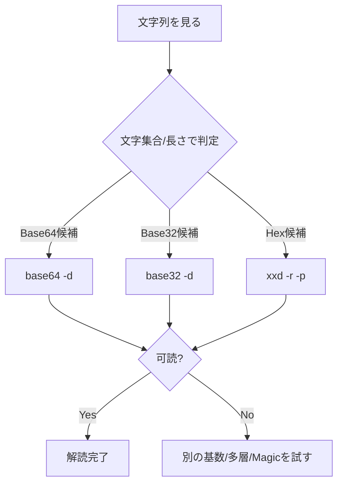

# Bases Writeup

## 概要

- 与えられた文字列: `bDNhcm5fdGgzX3IwcDM1`
- 直感: 文字集合が `A–Z a–z 0–9 + /`（`=` でパディングされることも）→ **Base64** っぽい。
- 結果: Base64 をデコードすると **`l3arn_th3_r0p35`**（=「learn the ropes」的な CTF フレーズ）。

## 解法ステップ

1. **判定**: Base64 かどうかの目安

   - 使用文字: `A–Z a–z 0–9 + /`（URL-safe では `- _`）。
   - 長さ: 通常は **4 の倍数**（パディング省略の場合もあり）。

2. **一次デコード**

   - CLI:

     ```bash
     echo -n 'bDNhcm5fdGgzX3IwcDM1' | base64 -d
     # => l3arn_th3_r0p35
     ```

   - Python:

     ```python
     import base64
     print(base64.b64decode('bDNhcm5fdGgzX3IwcDM1').decode())
     # l3arn_th3_r0p35
     ```

3. **検証**: 出力が可読英数字・単語（l33t）で、CTF のフラグ風 → 妥当。

## 代替手段（ツール）

- **CyberChef**: _From Base64_ を適用。
- **多層推定**のときは _Magic_（レシピ自動推測）を試す。

## ありがちなハマりどころ

- `echo` に `-n` を付けないと末尾に改行が入り、デコード結果にゴミが混ざる。
- URL-safe Base64（`-` と `_` を使用、`=` パディング省略可）に注意。
- パディング欠落で失敗する場合は、`=` を補って 4 の倍数長にする。
- 文字列がさらに **別の基数/暗号**に重ねられていることもある（Base32/Hex/ROT/ZIP など）。

## チートシート（簡易判定）

- **Base64**: `[A-Za-z0-9+/]` ときどき `=`、長さ 4n。
- **Base32**: `[A-Z2-7=]`、大文字主体、長さ 8n。
- **Hex**: `[0-9A-Fa-f]` のみ、2 桁で 1 バイト。



## 学び（要点）

- Base64 は **文字集合と長さ**で高速に当たりを付ける。
- CLI では `echo -n` とパディング補完がカギ。
- 出力が可読ならそこで止め、不可読なら **多層**を疑う。

## 最終答え

- `bDNhcm5fdGgzX3IwcDM1` → **`l3arn_th3_r0p35`**

---

## 参考コマンド集

```bash
# Base64
base64 -d <<< 'bDNhcm5fdGgzX3IwcDM1'

# Base32（例）
base32 -d <<< 'MFRGG==='

# Hex → バイナリ
xxd -r -p <<< '48656c6c6f'

# ROT系（Python one-liner 例 / rot13）
python - << 'PY'
s = 'uryyb'
import codecs
print(codecs.decode(s, 'rot_13'))
PY
```
