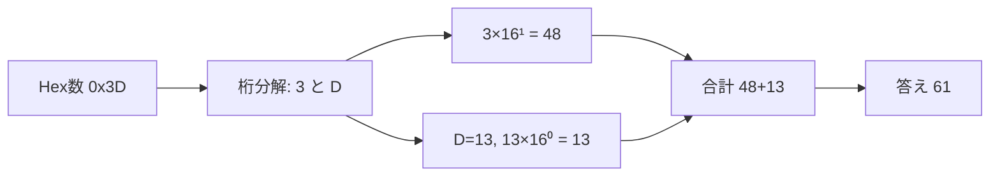

# Warmed Up — Writeup

Author: Sanjay C / Danny Tunitis

## 問題概要

> What is **0x3D (base 16)** in **decimal (base 10)**?

## 結論

**0x3D = 61 (10 進数)**

---

## 解法（手計算）

16 進数は各桁が 16 の冪を重みとして持つ。

- 桁展開: `0x3D = 3×16¹ + D×16⁰`
- 16 進の `D` は 10 進で **13**
- 計算: `3×16 + 13 = 48 + 13 = 61`

### 位置と重み

| 桁   | 文字 | 値(10 進) | 重み |     積 |
| ---- | ---- | --------: | ---: | -----: |
| 16¹  | 3    |         3 |   16 |     48 |
| 16⁰  | D    |        13 |    1 |     13 |
| 合計 |      |           |      | **61** |

---

## すぐ試す（検算）

### Python

```python
int("3D", 16)  # => 61
0x3D            # => 61
```

### Bash / bc

```bash
echo "ibase=16; 3D" | bc     # => 61
```

---

## 一般化の要点

- 16 進 → 10 進の基本式: (\sum\_{i=0}^{n-1} d_i\times 16^i)（右端が i=0）
- 2 桁の場合: `AB(16) = A×16 + B`
- 16 進の桁文字: `0–9, A(10) … F(15)`
- プレフィックス `0x` は **16 進** を表す慣習表記



---

## よくある落とし穴

- `D` を **14** と誤る（正しくは **13**）
- `0x` を数値に含めて計算してしまう（単なる接頭辞）
- 桁の重みを 10 の冪と勘違いする（16 の冪）

---

## 関連知識（チートシート）

- `A=10, B=11, C=12, D=13, E=14, F=15`
- 右からの重み: `…, 16³=4096, 16²=256, 16¹=16, 16⁰=1`

---

## まとめ

- `0x3D = 3×16 + 13 = 61`
- プレフィックスや桁重みを確認し、**桁分解 → 重み掛け → 合計** の順で確実に解く。
