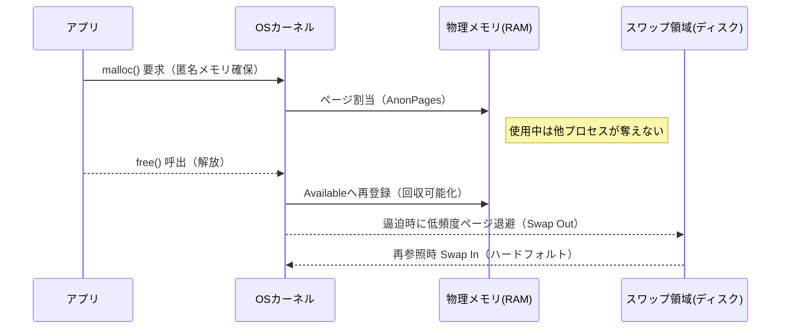
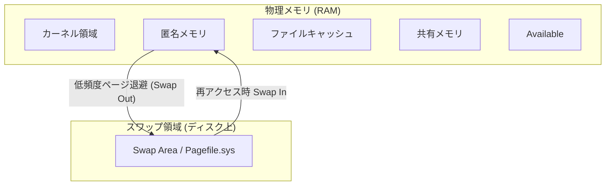

#OS #メモリ #パフォーマンス #匿名メモリ #スワップ #WorkingSet #PrivateBytes #Commit

メモリ（Memory）は、CPUと並ぶシステム性能の中核リソースである。  
本書は、**物理構造・OS抽象管理モデル・動作原理・匿名メモリ・スワップ・Working Set体系**を統合的に整理し、  
すべてのOSで通用する「統一メモリ理解モデル」を構築する。

---

## 1. メモリの二層構造

メモリ管理は **物理的構造（RAM上の配置）** と **論理的管理モデル（OSによる制御）** の二層で理解する。

---

### 1.1 物理構造（Physical Memory）

| 区分                       | 内容              | 説明                        |
| ------------------------ | --------------- | ------------------------- |
| **コード領域（Text）**          | 実行命令            | プログラム本体・共有ライブラリ。読み取り専用。   |
| **データ領域（Data）**          | グローバル・静的変数      | プログラム全体で共有される固定データ。       |
| **ヒープ（Heap）**            | 動的確保領域          | `malloc` / `new` により動的確保。 |
| **スタック（Stack）**          | 関数呼び出し構造・ローカル変数 | 呼び出し深度に応じて伸縮。スレッド単位。      |
| **ページキャッシュ（File Cache）** | ファイルI/Oバッファ     | OSが自動管理。逼迫時は回収可。          |
| **カーネル領域（Kernel Space）** | OS構造体・ドライバ      | 保護領域。回収不可。                |

---

### 1.2 OS共通抽象モデル（論理構造）

|区分|内容|回収性|代表指標|
|---|---|---|---|
|**① カーネル／予約領域**|OS構造体・ドライバ|不可|Slab / Wired / Nonpaged Pool|
|**② 匿名メモリ**|ヒープ・スタック・静的変数|難（使用中は回収不可）|AnonPages / Private Bytes|
|**③ ファイルキャッシュ**|ファイルI/Oキャッシュ|容易（逼迫時に自動回収）|Cached / Cache Bytes|
|**④ 共有メモリ**|IPC・共有ライブラリ|条件付き可|Shmem / Mapped File|
|**⑤ 未使用／再利用可能**|即時割当可能RAM|完全可|MemAvailable / Available MBytes|

---

### 1.3 対応（物理構成 ↔ 抽象区分）

|物理構成|抽象区分|特徴|
|---|---|---|
|コード領域|ファイルキャッシュ③ または共有④|ファイル裏付けあり。再読込可。|
|データ領域|匿名②|実行中変更データ。|
|ヒープ|匿名②|動的確保。負荷・リークの中心。|
|スタック|匿名②|呼び出し構造保持。|
|ページキャッシュ|ファイルキャッシュ③|I/O最適化。回収可。|
|カーネル領域|カーネル①|回収不可。|
|未使用RAM|未使用⑤|即時割当可。|

---

## 2. メモリ動作原理

1. アプリ要求 → 匿名メモリ②を割当。
    
2. ファイルアクセス → キャッシュ③を利用し高速化。
    
3. 逼迫時 → キャッシュ③や共有④を回収してAvailable⑤を確保。
    
4. さらに逼迫 → 匿名メモリ②の低頻度ページをスワップへ退避。
    
5. 再アクセス時 → スワップから再ロード（ハードフォルト）。
    

> OSの目的は **回収不能領域（①②）を最小化し、回収可能領域（③⑤）を循環させる** こと。

---

## 3. 匿名メモリの動作と責務

### 3.1 匿名メモリとは

ファイル裏付けを持たないヒープ・スタック等の領域。  
アプリ固有状態を保持するため **OSは勝手に回収できない**。

### 3.2 「解放」と「回収」の違い

|概念|主体|対象|意味|
|---|---|---|---|
|**解放 (Free)**|アプリ|自プロセス匿名メモリ|使用終了をOSへ返却 `free()`|
|**回収 (Reclaim)**|OS|キャッシュ・共有・未使用|逼迫時に再利用。|

> 匿名メモリはアプリが free() して初めて再利用可能。  
> OSの reclaim は安全に再生成できる領域にのみ及ぶ。

---

### 3.3 匿名メモリ循環モデル

---

## 4. スワップ領域の体系理解

### 4.1 概念と性質

スワップ領域（Swap Area）は、RAM不足時に低頻度ページを退避する**RAM外ストレージ空間**。  
RAM外にあるが、OSの仮想メモリ空間に統合される。

|属性|内容|
|---|---|
|**位置**|SSD/HDD上。RAM外。|
|**管理主体**|OSカーネル。|
|**対象**|匿名メモリ。|
|**目的**|OOM防止。|
|**副作用**|I/O遅延。頻発でスラッシング。|

---

### 4.2 スワップ抽象モデル

---

### 4.3 スワップ指標（OS非依存４抽象）

| 抽象区分                    | 意味                    | 代表OS指標                      |
| ----------------------- | --------------------- | --------------------------- |
| **① Swap Capacity**     | OSが利用できるスワップ総容量       | `SwapTotal` / Pagefile Size |
| **② Swap Availability** | 未使用スワップ残容量            | `SwapFree` / Pagefile Free  |
| **③ Swap Cache**        | 一度退避し再ロードされたページ       | `SwapCached`                |
| **④ Swap Activity**     | Swap In/Out 頻度（I/O負荷） | `si/so`, `HardFaults/sec`   |

> ①②＝静的容量、③④＝動的挙動。  
> ４軸でスワップ全体を把握できる。

---

## 5. Working SetとPrivate Set

### 5.1 定義

**Working Set**：

> 「ある時点で物理メモリ上に常駐し、プロセスが最近参照したページ集合」

**Private Set（Private Bytes）**：

> 「そのプロセスのみが所有するページ。共有されない匿名メモリ領域」

---

### 5.2 含有関係と特徴

|概念|含有関係|内容|
|---|---|---|
|**Working Set**|Private ＋ Shared|RAM上の全常駐ページ。短期的実効負荷。|
|**Private Set**|⊂ Working Set|専有メモリ。リーク検知対象。|
|**Commit**|⊃ Working Set|OSが確保を約束した仮想メモリ（RAM＋Swap）。|

> **Commit > Working Set > Private Set**  
> ＝ 仮想確保量 > RAM上実使用量 > アプリ固有量。

---

## 6. メトリクス総覧（全体統合）

|区分|指標|意味|用途|
|---|---|---|---|
|物理総量|`MemTotal`|RAM上限|基本容量確認|
|実効可用量|`MemAvailable`|即時利用可能RAM|逼迫判定|
|匿名メモリ|`AnonPages` / `Private Bytes`|実体負荷|リーク検知|
|キャッシュ|`Cached`|回収可能I/Oキャッシュ|健全性指標|
|スワップ容量|Swap Capacity|RAM外退避能力|設計評価|
|スワップ空き|Swap Availability|スワップ余力|逼迫度|
|スワップ活動|Swap Activity|Swap In/Out 頻度|スラッシング監視|
|ワーキングセット|RSS / Working Set|RAM常駐分|実効負荷|
|コミット|Commit Size|仮想確保総量|OS上限|

---

## 7. 評価原則

|評価軸|指標|正常状態|異常兆候|
|---|---|---|---|
|**可用性**|MemAvailable|高い|減少で逼迫|
|**匿名負荷**|AnonPages / Private Bytes|安定|継続増加＝リーク|
|**実効負荷**|Working Set / RSS|安定|持続上昇で過負荷|
|**スワップ活動**|Swap Activity|低い|頻発＝性能劣化|
|**安定性**|HardFaults/sec|低い|頻発でスラッシング|

---

## 8. 教授的結論

1. **OSはRAMとスワップを統合管理し、仮想メモリ空間を形成する。**
    
2. **Working SetはRAM上実効負荷**、**Private Setは専有領域**、**Commitは仮想確保総量**。
    
3. **匿名メモリはアプリ責務、スワップはOS責務。**
    
4. **スワップ４軸（Capacity・Availability・Cache・Activity）** で動態を把握する。
    
5. 健全性の指標：
    
    - MemAvailable が十分
        
    - AnonPages が安定
        
    - Swap Activity が低い
        
    - Working Set が過度に肥大しない
        

> **Memoryの理解とは、RAM内の配置とSwap外の退避を動的プロセスとして捉え、  
> OSが「どの情報を保持し、どの情報を一時退避させるか」を見抜くことである。**

---

## 9. 補足ドキュメント

> [[Memory_Dynamics|メモリ動態論・スワップ挙動補論]]

