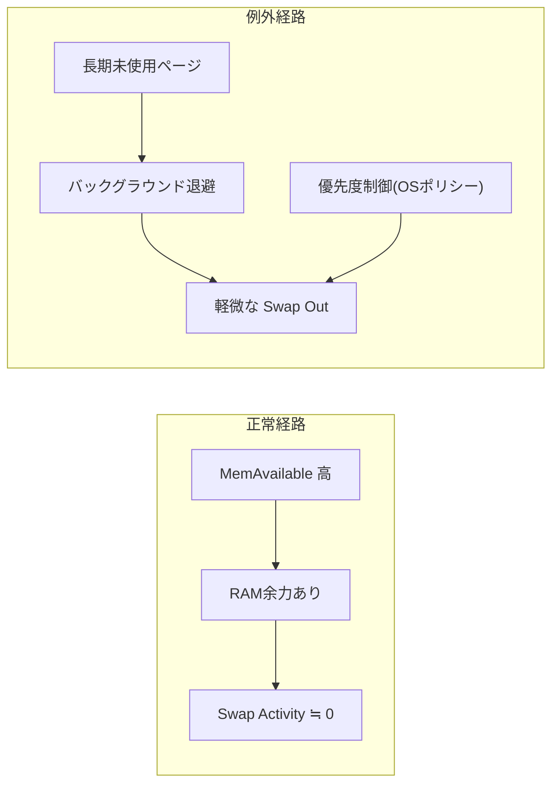

#OS #メモリ #スワップ #動作解析 #MemAvailable #SwapActivity

（メモリ動態論・スワップ挙動補論）

---

## 1. 目的

本補論は『Memory.md』における静的構造モデルを前提とし、  
**「MemAvailable が高いのになぜ Swap Activity が発生するのか」** を中心に、  
OSのスワップ制御ポリシー・例外的挙動・動的評価観点を体系的に説明する。

---

## 2. 前提原理：MemAvailable と Swap Activity の相関

|状態|MemAvailable|Swap Activity|原理的意味|
|---|---|---|---|
|**正常状態**|高い|ほぼゼロ|RAMに余力があり、スワップ不要。|
|**逼迫状態**|低い|上昇|匿名メモリを退避する必要発生。|
|**スラッシング**|枯渇|多発|頻繁な入出I/O。性能劣化。|

> **原則**：MemAvailable が十分にある場合、Swap Activity は基本的に発生しない。  
> OSがスワップを発生させるのは「RAM逼迫」または「ポリシー上の最適化」時のみ。

---

## 3. 例外的にスワップが発生する条件

### 3.1 長期未使用ページの冷却（Background Aging）

- 長期間アクセスされていない匿名メモリページを  
    「再使用の可能性が低い」と判断してディスクへ退避。
    
- OSが“空きRAMをキャッシュ拡張に活かす”ための最適化。
    
- Linux では `vm.swappiness` により挙動が制御される（既定：60）。
    

> ✅ MemAvailable が高くても Swap Out が少量発生するのはこの最適化動作による。

---

### 3.2 バックグラウンド優先度制御（Memory Pressure Balancing）

- ユーザ操作中のアプリを優先するため、  
    バックグラウンドプロセスの匿名ページをスワップへ追い出す。
    
- Windows や macOS ではこの制御が標準的に行われる。
    

> 目的は「表面上の応答性確保」であり、スワップは必ずしも逼迫を意味しない。

---

### 3.3 カーネル内部再配置（NUMA・HugePage最適化）

- メモリノードの再配置や巨大ページ統合処理により、  
    一時的にページがスワップ入出と同様に扱われる場合がある。
    
- 実質的にはスワップI/Oではないが、`si/so` に記録されることがある。
    

---

### 3.4 スワップキャッシュ（SwapCached）再利用

- 一度スワップされたページがRAMに戻り、  
    再度スワップアウトされる前に保持されている状態。
    
- このとき `SwapCached` が増加し、I/O削減に寄与。
    

> つまり、Swap Activity があっても実際の物理I/Oは発生していないことがある。

---

## 4. 図解：通常状態と例外状態の対比



---

## 5. 動的指標と評価観点

|観測対象|指標|意味|解釈指針|
|---|---|---|---|
|**スワップ静的容量**|SwapTotal / Capacity|スワップ全体の上限|物理メモリ外の安全弁。|
|**スワップ残容量**|SwapFree / Availability|未使用スワップ量|減少＝逼迫。|
|**スワップ活動量**|si/so・HardFaults/sec|スワップI/O頻度|多発で性能劣化。|
|**スワップキャッシュ**|SwapCached|RAM上保持済ページ|再利用によるI/O削減。|
|**実効余力**|MemAvailable|即時使用可能RAM|高いほど健全。|

---

## 6. 教授的分析：MemAvailable と Swap Activity の非線形関係

スワップ動作は単純な閾値ではなく、**非線形なポリシーベース制御**である。  
概念的には次のような三段階で変化する。

```text
MemAvailable ─────────────────────────────▶ 減少
     │         │                 │
     │         │                 │
  (A) 健全域   (B) 過渡域         (C) 逼迫域
     │         │                 │
     ▼         ▼                 ▼
 Swap 0     軽度Swap発生     頻発スワップ（スラッシング）
```

- **(A) 健全域**：全ページRAM上。Swap Activityゼロ。
    
- **(B) 過渡域**：OSポリシーによる軽微スワップ発生（キャッシュ優先など）。
    
- **(C) 逼迫域**：強制スワップ・性能劣化・OOMリスク。
    

---

## 7. 実務的判断指針

|状況|MemAvailable|Swap Activity|状況判定|対処|
|---|---|---|---|---|
|正常|高|0〜極小|健全状態|維持|
|軽度整理|高|少量|OS最適化|許容|
|過渡逼迫|中|増加|一時的スワップ|監視|
|深刻逼迫|低|多発|スラッシング|RAM増設 or アプリ最適化|

---

## 8. 教授的結論

1. **MemAvailable が高い状態では Swap Activity は基本的に発生しない。**
    
2. ただし、OSは性能最適化のために**非逼迫状態でも軽度スワップを意図的に行う**場合がある。
    
3. その背景には
    
    - 長期未使用ページの冷却（Aging）
        
    - フォアグラウンド優先制御
        
    - スワップキャッシュ再利用  
        などのポリシーがある。
        
4. よって、
    
    - **MemAvailable は静的余力の指標**
        
    - **Swap Activity は動的挙動の指標**  
        として補完的に観察することが望ましい。
        

---

## 9. 教授的比喩まとめ

|概念|例え|説明|
|---|---|---|
|**MemAvailable**|空いている机のスペース|今すぐ使えるRAMの余地|
|**Swap Activity**|倉庫に一時保管して出し入れしている資料|OSが一時退避・再投入しているページ|
|**SwapCached**|倉庫前に積んである再利用資料|次にすぐ戻せるページ群|

---

> **結論：**  
> スワップは「逼迫の結果」だけでなく「最適化の副作用」としても発生する。  
> したがって、MemAvailable と Swap Activity の関係は単なる比例ではなく、  
> **OS設計思想（ポリシー）を反映した動的均衡関係**である。

---
