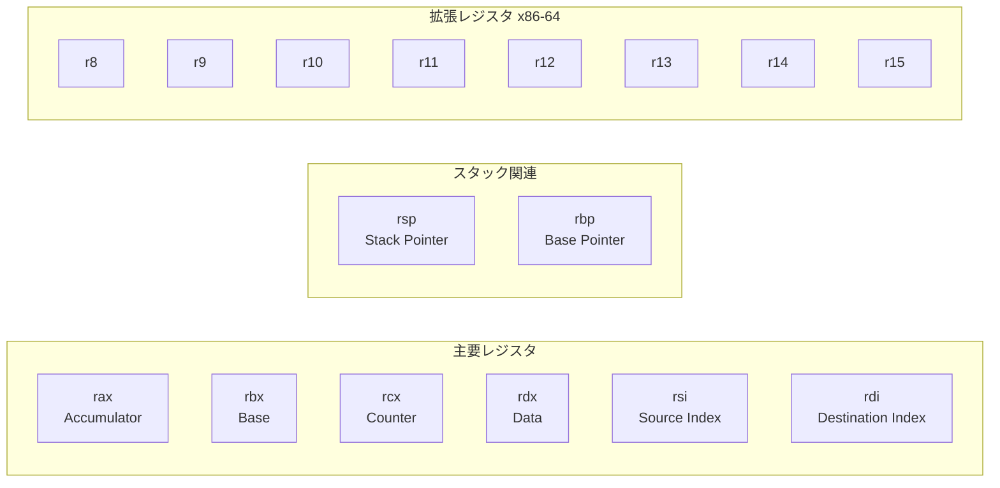
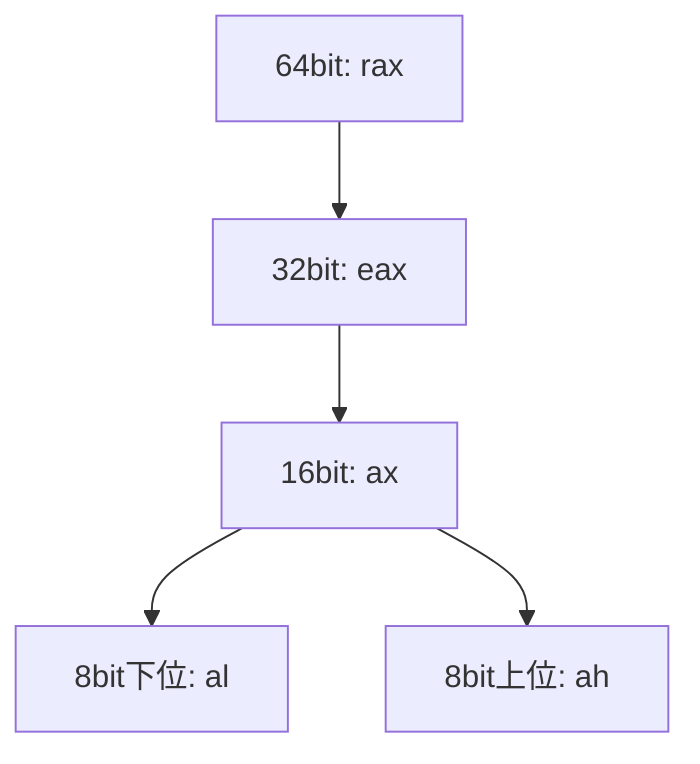
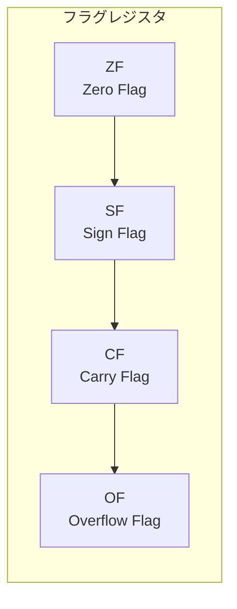
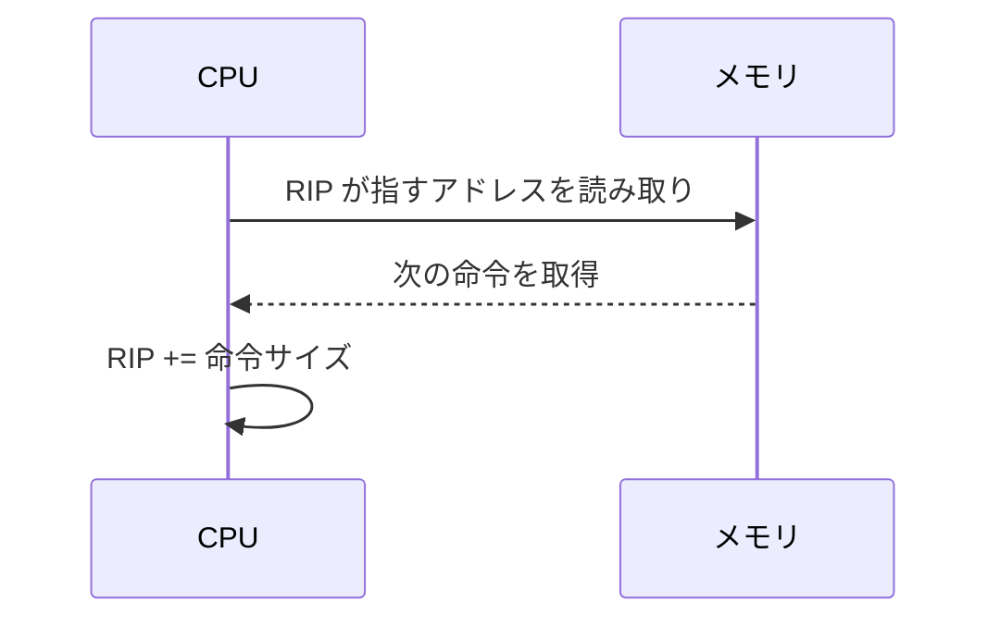
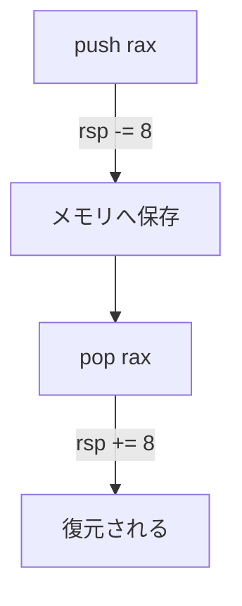
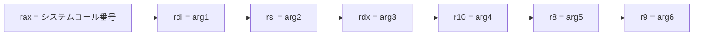

# アセンブリ言語（x86-64）レジスタまとめ（簡易版・図解付き）

---

# 1. 汎用レジスタ（General Purpose Registers）

### ■ 略語の意味（重要）

| レジスタ | 略語の意味 | 役割（簡潔） |
|----------|-------------|--------------|
| **rax** | **A**ccumulator | 計算結果・関数戻り値 |
| **rbx** | **B**ase | 汎用（x86古来のベースレジスタ） |
| **rcx** | **C**ounter | ループカウンタ |
| **rdx** | **D**ata | 除算・乗算、システムコール引数 |
| **rsi** | **S**ource **I**ndex | データ読み出し元アドレス |
| **rdi** | **D**estination **I**ndex | データ書き込み先アドレス |
| **rsp** | **R**ack **P**ointer | スタックトップ |
| **rbp** | **B**ase **P**ointer | 関数フレーム基準 |
| **r8–r15** | 追加汎用レジスタ | x86-64で追加された拡張領域 |

---

# 2. 汎用レジスタの全体像（Mermaid 図）



---

# 3. レジスタの階層構造（大小サイズの関係）



---

# 4. フラグレジスタ（RFLAGS）



---

# 5. RIP（次に実行する命令アドレス）



---

# 6. スタック動作（rsp / rbp）



---

# 7. システムコールのレジスタ配置



---

# 8. 最小限覚えるべきまとめ（暗記用）

```
・rax：計算結果・戻り値
・rsp/rbp：関数とスタックの中心
・rsi/rdi：メモリアクセス
・rcx：カウンタで使われる
・cmp/test → ZF/SF/CF/OF → jz/jnz/jg/jl などの条件分岐へ
・syscall：rax=番号、引数 rdi→rsi→rdx→r10→r8→r9
```
