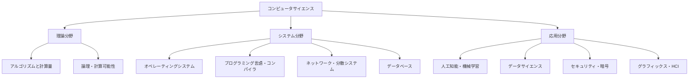

### ― 計算と情報の科学 ―

---

## 第1章　コンピュータサイエンスとは何か

> **コンピュータサイエンス（Computer Science）とは、情報をどのように表現し、計算によって処理・活用するかを研究する科学である。**

- コンピュータサイエンスは「コンピュータの使い方」を学ぶ学問ではない。
    
- 「**計算という現象を理解するための科学**」であり、数学・論理・工学を統合する知の体系である。
    

---

## 第2章　計算とは何か

- **計算 (Computation)** とは、  
    「有限の手順に従って入力を出力に変換する過程」である。
    
- コンピュータサイエンスはこの「手順＝アルゴリズム」と「変換の限界」を研究する。
    

計算を理解する3つの視点：

|視点|例|説明|
|---|---|---|
|**理論**|何が計算できるか|計算可能性理論・計算量理論|
|**システム**|どう実現するか|OS・言語・ネットワーク|
|**応用**|何に使うか|AI・データ解析・セキュリティ|

---

## 第3章　コンピュータサイエンスの構造

---

## 第4章　CSを支える数理基盤

|分野|主要概念|関連分野|
|---|---|---|
|**離散数学**|集合・グラフ・論理・組合せ|アルゴリズム・データ構造|
|**論理学**|命題論理・述語論理・証明|プログラム検証・AI|
|**確率・統計**|確率分布・推定・最尤法|機械学習・データ解析|
|**線形代数**|行列・ベクトル・固有値|グラフィックス・深層学習|
|**情報理論**|エントロピー・符号化・通信|暗号・データ圧縮|

---

## 第5章　[[理論分野]] ― 計算の限界を探る

| 分野                         | 内容                | 代表概念              |
| -------------------------- | ----------------- | ----------------- |
| [[アルゴリズム目次\|アルゴリズム]]       | 問題を解く手続き          | ソート、探索、動的計画法      |
| [[データ構造目次\|データ構造]]         | 情報を効率的に格納・操作する仕組み | 配列、木、グラフ、ハッシュテーブル |
| [[計算量理論目次\|計算量理論]]         | どれだけ速く計算できるか      | P, NP, NP完全       |
| [[計算可能性理論目次\|計算可能性理論]]     | 何が計算可能か           | チューリングマシン         |
| [[自動機械・形式言語目次\|自動機械・形式言語]] | プログラムの形式的扱い       | 正規言語、文脈自由文法       |

> 理論は「**限界と最適化の科学**」である。  
> どの問題が「原理的に解けるか・どの程度効率的に解けるか」を明らかにする。

---

## 第6章　システム分野 ― 理論を動かす仕組み

|分野|内容|例|
|---|---|---|
|**OS**|計算資源の管理|Linux, Windows|
|**プログラミング言語・コンパイラ**|構文解析・最適化・コード生成|C, Rust, LLVM|
|**ネットワーク**|通信・分散処理|TCP/IP, HTTP|
|**データベース**|構造化データ管理|SQL, NoSQL|
|**分散システム**|ノード間整合性・耐障害性|Kubernetes, Kafka|

> システム分野は「**計算を実際に動かす工学**」。  
> 理論の成果がここで現実の技術として具現化する。

---

## 第7章　応用分野 ― 計算で世界を理解する

|分野|内容|代表技術|
|---|---|---|
|**人工知能・機械学習**|学習と推論のアルゴリズム|ニューラルネットワーク、強化学習|
|**データサイエンス**|データ解析・可視化・予測|Python, Pandas|
|**セキュリティ・暗号**|情報保護・認証・暗号化|AES, RSA, TLS|
|**グラフィックス・HCI**|視覚表現・UI設計|Unity, VR, UX設計|

> 応用は「**計算を通じて現実を理解・制御する**」段階である。

---

## 第8章　CSの思考法 ― 抽象化と再利用

|思考法|意味|ソフトウェア開発の例|
|---|---|---|
|**抽象化 (Abstraction)**|本質だけを取り出す|インタフェース設計|
|**分割統治 (Divide & Conquer)**|問題を小さく分ける|モジュール化、マイクロサービス|
|**再帰 (Recursion)**|自身を使って定義する|木構造探索、再帰関数|
|**モデル化 (Modeling)**|現実を計算モデルで表す|DDD, シミュレーション|
|**依存構造の制御**|有向非巡回構造（DAG）で整理|CIパイプライン、依存解決|

> これらは**思考のアルゴリズム化**とも言える。  
> CSは「考え方そのものを形式化する学問」である。

---

## 第9章　CSと他分野のつながり

|分野|接点|
|---|---|
|**数学**|計算理論・論理・離散構造|
|**物理学**|シミュレーション・量子計算|
|**生物学**|ニューラルネット・遺伝的アルゴリズム|
|**心理学**|認知モデル・UI/UX設計|
|**経済学**|ゲーム理論・アルゴリズム的メカニズム設計|

> CSは「情報を通じて自然・社会を理解する科学」である。

---

## 第10章　歴史の流れ（100年の計算史）

|時期|主題|出来事|
|---|---|---|
|**1930年代**|理論の誕生|チューリング・ゲーデル・フォンノイマン|
|**1940–50年代**|電子計算機の登場|ENIAC、命令型プログラミング|
|**1960–70年代**|ソフトウェア工学の確立|OS、C言語、データ構造理論|
|**1980–90年代**|ネットワークとWebの拡張|インターネット、オブジェクト指向|
|**2000年代以降**|大規模計算と知能化|クラウド、AI、量子計算|

---

## 第11章　CSの本質と価値

|観点|内容|
|---|---|
|**科学として**|「情報」「計算」の普遍的原理を解明する。|
|**工学として**|理論を実装し、信頼性あるシステムを構築する。|
|**思考法として**|抽象化・分割統治・アルゴリズム的思考を育てる。|
|**社会的意義**|知的活動の自動化と、情報による世界理解を推進する。|

---

## 結論：ひとことで言うなら

> **コンピュータサイエンスとは、「計算とは何か」を科学的に理解し、その力で現実世界の問題を解く学問である。**

---
