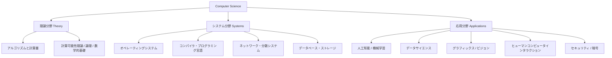

#  コンピュータサイエンスとは — 計算と情報の科学

> **コンピュータサイエンス（CS）とは、情報をどのように表現し、処理（計算）し、利用するかを探求する科学。**

「コンピュータを使う学問」ではなく、  
「**計算（Computation）という現象を理解する学問**」です。  
そして「計算」を支える数学・論理・工学を総合した領域です。

---

## 1. コンピュータサイエンスの定義と目的

|観点|内容|
|---|---|
|**定義**|情報を表現し、アルゴリズムによって処理する原理を研究する科学。|
|**目的**|効率的・安全・再現的に「計算」を行うための理論・システム・応用を作る。|
|**中心概念**|情報 (Information)、計算 (Computation)、アルゴリズム (Algorithm)、データ構造 (Data Structure)|

つまり：

> 「どうやって問題をコンピュータが解ける形にするか」  
> 「その計算をどう設計・分析・最適化するか」  
> を考える学問です。

---

## 2. コンピュータサイエンスの全体像

> **理論**は「何が可能か・どのくらい速くできるか」を研究する。  
> **システム**は「どう作るか」を研究する。  
> **応用**は「何に使うか」を研究する。

---

## 3. CSの基礎となるキーワード

|分野|主要概念|説明|
|---|---|---|
|**情報**|ビット、符号化、情報量|すべてのデータは情報単位（bit）で表される。|
|**計算**|アルゴリズム、チューリングマシン、計算モデル|「どんな手順で情報を処理できるか」。|
|**アルゴリズム**|探索、ソート、グラフ理論、動的計画法|効率的に問題を解くための手続き。|
|**データ構造**|配列、木、グラフ、ハッシュテーブル|データの格納と操作を最適化する構造。|
|**複雑性理論**|P, NP, NP完全、近似計算|問題を「どれだけ計算が難しいか」で分類。|
|**自動機械理論**|正規言語、有限オートマトン、文脈自由文法|プログラム言語やコンパイラの理論基盤。|

---

## 4. CSを支える数理的基盤

|領域|内容|関連するCS分野|
|---|---|---|
|**離散数学**|集合、グラフ理論、論理、組み合わせ|アルゴリズム・データ構造|
|**論理学**|真理値、推論、命題/述語論理|プログラム検証、AI|
|**確率・統計**|確率分布、統計推定|機械学習、データサイエンス|
|**線形代数**|ベクトル、行列、固有値|グラフィックス、深層学習|
|**情報理論**|符号化、エントロピー、通信理論|圧縮、暗号、通信|

---

## 5. システム分野：理論を動く形にする

|領域|内容|例|
|---|---|---|
|**OS（オペレーティングシステム）**|資源管理・スケジューリング|Linux, Windows, macOS|
|**プログラミング言語・コンパイラ**|構文解析、最適化、コード生成|C#, Java, Rust, LLVM|
|**ネットワーク**|プロトコル、通信、分散処理|TCP/IP, HTTP, gRPC|
|**データベース**|クエリ最適化、トランザクション|SQL, NoSQL|
|**分散システム**|複数ノードでの整合性と耐障害性|Kubernetes, Kafka|

これらは**OSからアプリまでの階層を設計する“計算機の工学”** です。  
理論の成果（スケジューリング理論・データ構造・アルゴリズム）が、ここで具現化されます。

---

## 6. 応用分野：計算で現実世界を解く

| 分野                   | 内容              | 代表技術                  |
| -------------------- | --------------- | --------------------- |
| **人工知能 / 機械学習**      | 学習アルゴリズム・最適化・統計 | ニューラルネット・強化学習         |
| **データサイエンス**         | データ解析・可視化・モデル化  | Python, Pandas, NumPy |
| **セキュリティ / 暗号**      | 情報保護・認証・計算困難性   | AES, RSA, TLS         |
| **コンピュータグラフィックス**    | モデリング・レンダリング    | Unity, Unreal Engine  |
| **HCI / ヒューマンファクター** | UI/UX設計、入力デバイス  | UIデザイン、VR、認知科学        |

応用領域では理論とシステムの両輪が必要です。  
例えば、AIの基礎には線形代数・確率・計算理論が全て含まれています。

---

## 7. CSの中心的な概念：「抽象化と再利用」

コンピュータサイエンスの「思考法」は、どの分野でも共通しています。

| 思考法                           | 意味             | ソフトウェア開発での例                |
| ----------------------------- | -------------- | -------------------------- |
| **抽象化 (Abstraction)**         | 共通パターンを一般化     | Interface, クラス設計           |
| **分割統治 (Divide and Conquer)** | 問題を小さく分けて解く    | クリーンアーキテクチャ、マイクロサービス       |
| **[[DAG]]的依存構造**              | 一方向の依存関係       | ProjectReference, CIパイプライン |
| **モデル化 (Modeling)**           | 現実を計算モデルに置き換える | DDD (Domain-Driven Design) |
| **再帰的思考 (Recursion)**         | 自分自身を使って問題を定義  | 階乗、ツリー探索、アルゴリズム設計          |

これらは「アルゴリズムの設計」だけでなく「大規模システム設計」にも直接つながる考え方です。

---

## 8. CSと他分野との関係

|関連分野|接点|
|---|---|
|**数学**|計算理論、離散構造、確率・統計|
|**物理学**|シミュレーション、量子計算|
|**生物学**|バイオインフォマティクス、ニューラルネット|
|**心理学**|ヒューマンインタフェース、人工知能|
|**経済学**|ゲーム理論、アルゴリズム的メカニズムデザイン|

CSは「**情報の科学的理解**」を通じて、  
自然科学・社会科学の橋渡しを行う学問でもあります。

---

## 9. 歴史的背景（ざっくり100年の流れ）

|時期|出来事|
|---|---|
|1930年代|チューリング、ゲーデル、フォン・ノイマンが「計算可能性」「数理論理」を定義。|
|1940〜50年代|最初の電子計算機（ENIAC）。機械語・アセンブリ時代。|
|1960〜70年代|OS・高級言語（C, Lisp, Pascal）・データ構造理論の確立。|
|1980年代|ネットワークとGUIの普及。オブジェクト指向誕生。|
|1990年代|Web時代。アルゴリズムの大規模応用。|
|2000年代以降|分散処理・機械学習・クラウド・量子計算へ。|

> 現代のソフトウェア開発は、これらCS理論の積み重ねの上にある。

---

## 10. まとめ：CSの本質と価値

|観点|内容|
|---|---|
|**科学として**|「計算とは何か」「情報とは何か」を定義し、普遍的法則を探る。|
|**工学として**|計算を利用した実用的システムを設計・構築する。|
|**思考法として**|抽象化・分割統治・アルゴリズム的思考を育てる。|
|**社会への影響**|すべての科学・産業・文化に「計算による理解と自動化」をもたらす。|

---

### ひとことで言うなら：

> **コンピュータサイエンスとは、「計算するとはどういうことか」を科学的に理解し、それを現実世界の問題解決へ応用する学問である。**

---
