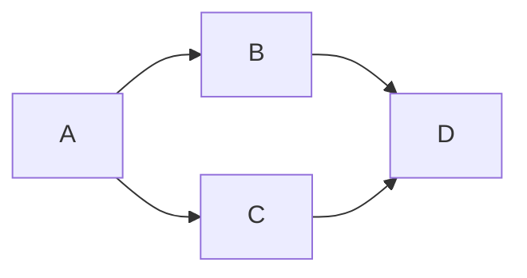
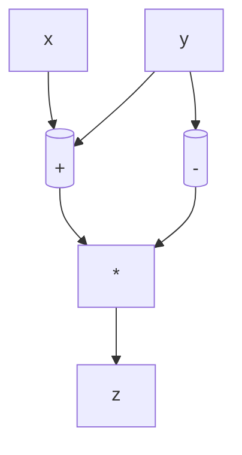
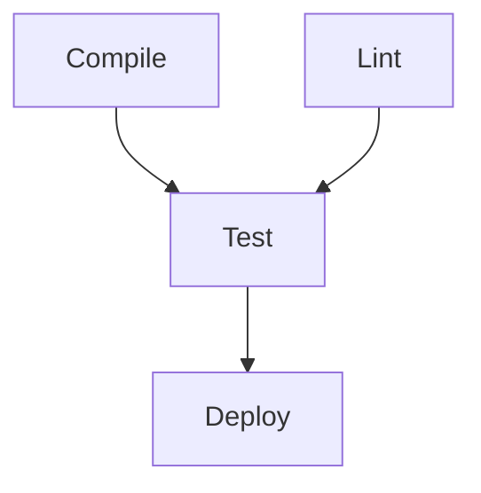
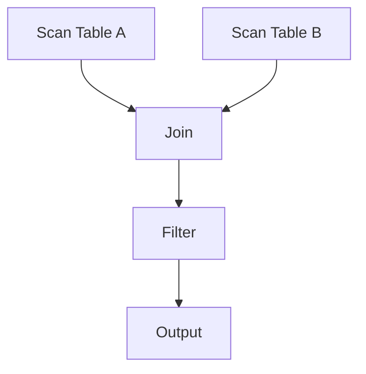
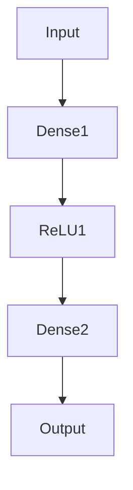

# Directed Acyclic Graph（DAG） — 計算と依存の普遍構造

---

## 1. DAGとは何か

**DAG（Directed Acyclic Graph）** は、  
**向き（Directed）** をもつ辺と、**循環（Cycle）が存在しない（Acyclic）** グラフ（Graph）のこと。



- **Directed（有向）**：辺に「流れ」や「依存の向き」がある
    
- **Acyclic（非循環）**：どのノードからも自分自身に戻る経路が存在しない
    
- **Graph（グラフ）**：ノード（点）とエッジ（線）で構成される構造体

つまりDAGは、

> **“矢印で結ばれた一方向の関係の集まり”**。  
> そこには「先に処理されるべきもの」と「後に処理されるもの」の**順序**が生まれる。

---

## 2. DAGの構造的性質

| 性質                       | 説明                                   |
| ------------------------ | ------------------------------------ |
| **非循環性 (Acyclicity)**    | 任意のノードから出発しても、再び同じノードに戻ることができない。     |
| **部分順序 (Partial Order)** | ノード間に「順序」が定義できるが、すべてのノードが比較可能ではない。   |
| **トポロジカルソート可能性**         | DAGであれば必ずトポロジカル順序（依存を壊さない順序付け）が存在する。 |
| **階層的表現**                | ルート（根）→葉へ向かう階層構造に変換できる。              |
| **動的計画法適用性**             | サイクルがないため、計算結果を一方向に蓄積できる（メモ化に向く）。    |

DAGは**木構造（Tree）** の一般化と言えます。  
木は親が1つしかないDAG、DAGは複数の親を許す木です。

---

## 3. トポロジカルソート（Topological Sort）

DAGにおいて最も重要な操作が **トポロジカルソート** です。  
これは「依存関係を壊さないようにノードを一列に並べる操作」。


上のDAGのトポロジカル順序は例えば：

> A → B → C → D  
> A → C → B → D  
> どちらも依存関係を壊していない。

### アルゴリズム（Kahn法）

```pseudo
inDegree[v] = v に入る辺の数
S = 入次数0のノード集合
order = []

while S が空でない:
    v = Sから取り出す
    order.append(v)
    for each edge (v -> u):
        remove edge
        if inDegree[u] == 0:
            S に追加

辺が残っていれば循環あり（DAGではない）
```

**計算量：** O(V + E)（ノード＋エッジの数に比例）  
**性質：** トポロジカル順序が存在する ⇔ グラフがDAGである。

---

## 4. DAGの理論的意味

### (1) 部分順序構造 (Partial Order)

DAGは数学的には「部分順序集合（poset）」をグラフで表したものです。

- 順序関係 `a ≤ b` が「a → b」という矢印で表される。
    
- 全ノード間で比較可能とは限らない（独立したノードがありうる）。
    
- トポロジカルソートはこの部分順序を線形順序（linear extension）に変換する操作。

### (2) 計算依存のモデル

- 多くの計算は「結果が他の結果に依存する」構造を持つ。  
    → 式の評価順、プログラムの依存解析、データフロー解析など。
    
- DAGはこの**依存の有向性と非循環性**を表す数学的モデル。

### (3) DAGと時間

DAGは「時間的順序」や「因果関係」を表すモデルとしても利用される。  
例：イベントログ、バージョン履歴、ブロックチェーン（後述）。

---

## 5. DAGが活躍する主要分野と応用例

### アルゴリズム・データ構造

- **トポロジカルソート**
    
- **最長経路問題（Longest Path in DAG）**  
    → 一般グラフではNP困難だが、DAGではO(V+E)で解ける。
    
- **動的計画法（Dynamic Programming）**  
    → DAG上の依存を使って効率的に計算を伝搬。
    


たとえば「A→B→D」「A→C→D」の最長経路を動的計画で求める。

---

### コンパイラ・依存解析

- **式木（Expression Tree）** や**データフローグラフ**はDAG。  
    例：`z = (x + y) * (y - 2)` → 共通部分式 `(y)` を1つにまとめるDAG表現。
    
- **命令スケジューリング**：依存を壊さずに命令を並べるためのトポロジカルソート。
    



---

### ⚙️ タスクスケジューリング・パイプライン

- **ビルドシステム（Make, Ninja, Bazelなど）**
    
- **CI/CDパイプライン（GitHub Actions, Airflow）**
    
- **並列ジョブ実行（HPC, DAG Scheduler）**

すべて「どのタスクがどの結果に依存するか」をDAGで表現し、  
トポロジカルソートで実行順や並列化を決定する。



---

### データベース・データ処理

- **クエリ実行計画**（SQLの最適化器）  
    → テーブル結合やフィルタの依存をDAGとして解析。
    
- **分散処理フレームワーク**（Spark, Flink）  
    → DAGでジョブ全体を表し、データフローをスケジューリング。
    



---

### 🔗 バージョン管理とブロックチェーン

- **Gitのコミット履歴**はDAG（ブランチは分岐・マージで構成）。  
    → ループがないため履歴が常に一方向に進む。
    
- **DAG型ブロックチェーン（IOTA, Avalancheなど）**  
    → 従来の線形ブロック連鎖をDAG構造に拡張して並列化。
    

---

### 🧠 機械学習

- **ニューラルネットワーク**はDAG：  
    各ノードが層（Layer）・演算（Operation）を表す。
    
- **TensorFlow / PyTorch**などの計算グラフもDAG構造。  
    勾配計算（バックプロパゲーション）はDAGを逆向きにたどる。
    



---

## 6. DAGの検出と性質判定

### DAG判定

- DFSで探索中に「まだ確定していないノードへの戻り辺」があれば**サイクル**。
    
- またはトポロジカルソートを実行して**全ノードが並べられればDAG**。
    

### サイクル除去（Cycle Breaking）

- サイクルを壊すには：
    
    - エッジを削除する（最小フィードバックアーク集合問題）
        
    - ノードを分離・抽象化する
        
    - 依存方向を明示して一方向化する
        

---

## 7. DAGと計算の哲学的側面

DAGは単なるデータ構造ではなく、**因果関係のモデル**でもあります。

|観点|DAGでの意味|
|---|---|
|**時間**|過去→未来への一方向的流れ|
|**因果性**|原因→結果|
|**依存性**|入力→出力|
|**情報フロー**|ソース→シンク|
|**計算**|中間結果→最終結果|

このため、**「DAGで表現できる＝決定的に計算できる」** ことを意味します。  
反対に、**循環を含む構造（ループ）** は「状態を持つ」「継続的に変化する」計算を表します（例：再帰、オートマトン、システム論）。

---

## 8. DAGの数理的位置づけ

|概念|DAGとの関係|
|---|---|
|**有向グラフ (Directed Graph)**|DAGはその部分集合（Cycle=0）。|
|**トポロジカル順序 (Topological Order)**|DAGに一意または複数存在。|
|**部分順序集合 (Poset)**|DAGはPosetのグラフ的表現。|
|**ハッセ図 (Hasse Diagram)**|Posetを簡略化したDAGの一種。|
|**有向森 / 木 (Directed Tree)**|DAGの特殊ケース（親が1つ）。|

---

## 9. 計算の世界でDAGが意味するもの

- **計算 = DAGの評価**
    
    - 式、依存、処理手順をすべて「ノードと矢印」で表せる。
        
    - 実際、コンピュータは内部的にあらゆる処理をDAG的に最適化している。
        
- **並列性の根拠**
    
    - 依存がないノードは同時に処理できる。
        
    - DAGの構造がそのまま「安全な並列実行領域」を示す。
        
- **安定性の根拠**
    
    - 循環がないため「再現性」が保証される。
        
    - これがビルド、データフロー、AIモデルなどで重視される理由。
        

---

## 10. まとめ — DAGは計算の秩序を与える

|本質|内容|
|---|---|
|**構造的意味**|依存と順序のモデル。非循環性が安定性をもたらす。|
|**計算的意味**|プログラム・データフロー・学習など、あらゆる処理を表現できる。|
|**理論的意味**|部分順序・因果構造・決定的計算の数学的表現。|
|**実践的意義**|並列化、最適化、再現性のある計算の基盤。|

---

> 🔹 **DAGとは「情報が一方向に流れる世界」**。
> 
> そこでは、因果関係と依存関係が明確になり、  
> 計算や知識の構造を**秩序立てて理解する**ことができる。

---
### DAG関連タグ一覧

#### 基本概念・定義

#DAG  #有向非巡回グラフ  #グラフ理論  #有向グラフ  #非巡回  #ノード  #エッジ  #依存関係  #階層構造  #部分順序  #順序関係  #ハッセ図  #トポロジカル順序

#### 数学的背景・理論

#離散数学  #順序理論  #計算モデル  #因果関係  #情報流  #決定性  #形式体系  #構造的数学  #関係構造

#### アルゴリズム・計算

#トポロジカルソート  #Kahnアルゴリズム  #深さ優先探索  #最長経路問題  #動的計画法  #メモ化  #グラフ探索  #サイクル検出  #依存解決 

#### 応用領域

#コンパイラ設計  #データフロー解析  #タスクスケジューリング  #ビルドシステム  #パイプライン  #並列計算  #クエリ最適化  #分散処理  #ブロックチェーン  #Git  #バージョン管理  #ニューラルネットワーク  #機械学習  #計算グラフ

#### 思考法・設計指針

#抽象化  #依存管理  #情報構造  #因果モデル  #計算順序  #システム設計  #再現性  #並列化  #安定性  #順序保持

---