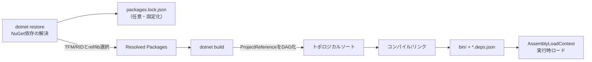
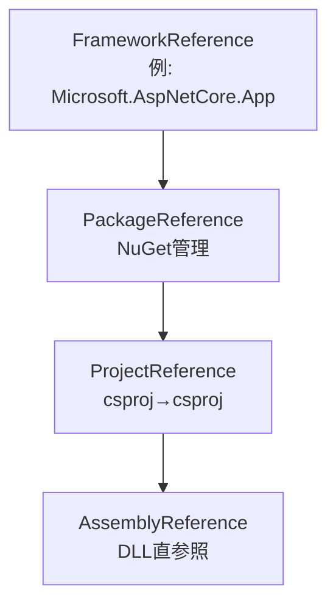
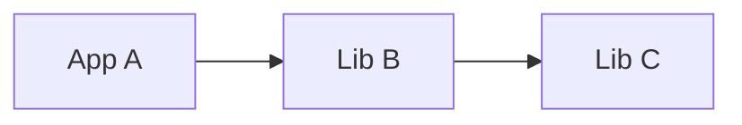
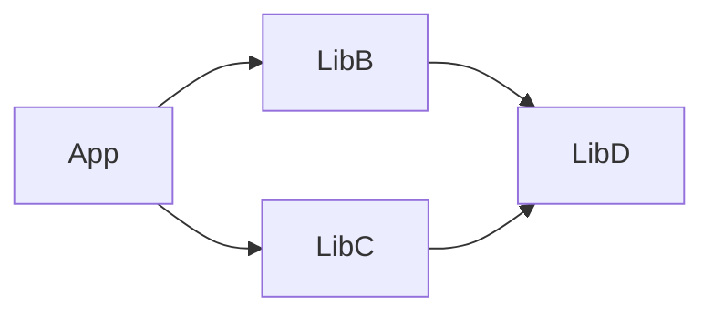
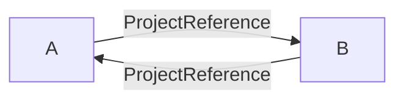
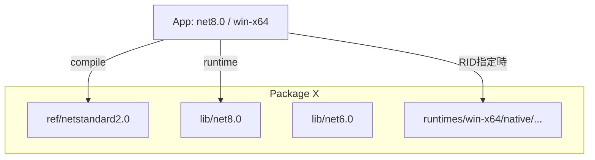
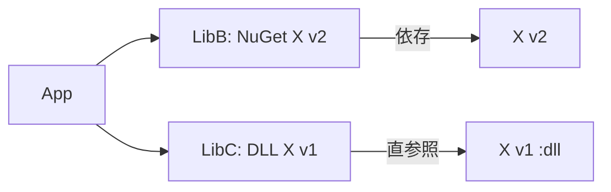
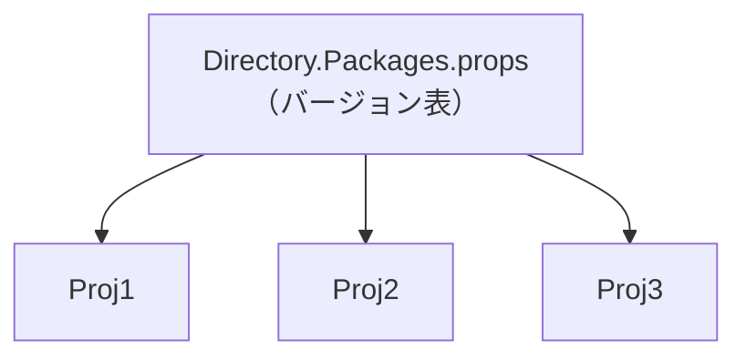
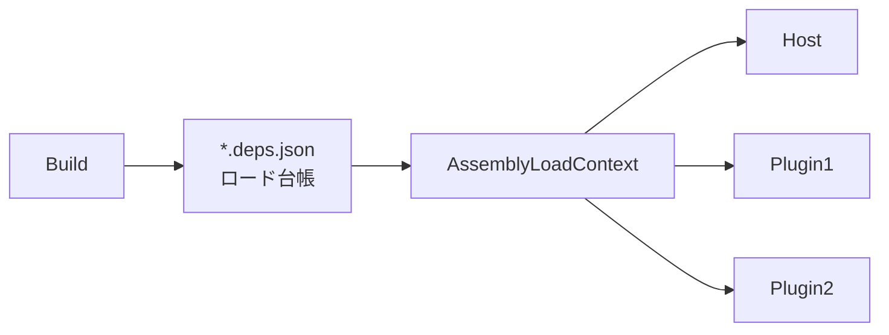

> 対象: SDK スタイルの .NET（.NET 6/7/8+）  
> 主な論点: `restore`（NuGet解決）と `build`（参照解決/コンパイル）の分離、バージョン競合の収束、循環参照の解消、TFM/RID、DLL直参照の扱い、中央集権管理、実行時ロード

---

## まず全体の流れを掴む： 「restore」で決めて「build」で形にする



- `restore`: パッケージ（直接/間接）の**バージョン**と**資産（ref/lib/runtimes）** を確定。`packages.lock.json` があれば**固定**。
    
- `build`: **ProjectReference グラフ** を **[[DAG]]（循環なし）** として並べ、参照DLLを束ねてコンパイル。
    
- 実行時: `*.deps.json` の指示に従い **AssemblyLoadContext** がロードを最終決定。
    

**再現性の鉄板**: CI では `dotnet restore --locked-mode` → `dotnet build`。

---

## 依存の種類は4つ：どこで効くかが違う



- **FrameworkReference**: 共有ランタイム依存（ASP.NET Core など）。
    
- **PackageReference**: NuGet管理。**競合は原則「最大バージョン」へ収束**。`restore`で決まる。
    
- **ProjectReference**: ソース依存。**[[DAG]]** 前提で**トポロジカルソート**。`build`で効く。
    
- **DLL直参照（AssemblyReference）**: NuGetの外側。**競合解決が弱い／非伝播**。極力避ける。
    

DLL直参照の例（必要最小限で）:

```xml
<ItemGroup>
  <Reference Include="LegacyLib">
    <HintPath>libs/LegacyLib.dll</HintPath>
  </Reference>
</ItemGroup>
```

---

## 直列依存（A→B→C）で起きる「上位押し上げ」とダウングレード警告



- 同じパッケージが複数バージョンで現れると、基本は**最大バージョン**で収束。
    
- 上位プロジェクトで古い版を**固定**すると、下位の新しい版に負けて **NU1605（Detected package downgrade）** が出がち。

すぐ試せる最小例:

```bash
mkdir DepPlay && cd DepPlay
dotnet new sln -n DepPlay

dotnet new console -n AppA
dotnet new classlib -n LibB
dotnet new classlib -n LibC
dotnet sln add AppA/AppA.csproj LibB/LibB.csproj LibC/LibC.csproj

dotnet add AppA/AppA.csproj reference LibB/LibB.csproj
dotnet add LibB/LibB.csproj reference LibC/LibC.csproj

dotnet add LibC/LibC.csproj package Newtonsoft.Json --version 12.0.3
dotnet add LibB/LibB.csproj package Newtonsoft.Json --version 13.0.3

dotnet restore
dotnet list AppA/AppA.csproj package --include-transitive
# => Newtonsoft.Json は 13.0.3 に収束（最大優先）
```

**安定化の定石**

- トップ（AppA）で最低/固定バージョンを明示（`Version=">=13.0.3"` など）。
    
- さらに良いのは後述の **中央集権（CPM）**。

---

## ダイヤモンド依存の収束：トップで意図を明示してブレを止める



- B/C が D の異なるバージョンを要求しても、原則**最大**へ収束。
    
- **トップのApp**で D を**明示**すると、意図が固定されて「たまたま最大」から「狙って固定」へ。
    

すぐ試す:

```bash
dotnet new console -n App
dotnet new classlib -n LibB
dotnet new classlib -n LibC
dotnet new classlib -n LibD
dotnet sln add App/App.csproj LibB/LibB.csproj LibC/LibC.csproj LibD/LibD.csproj

dotnet add LibB/LibB.csproj reference LibD/LibD.csproj
dotnet add LibC/LibC.csproj reference LibD/LibD.csproj
dotnet add App/App.csproj   reference LibB/LibB.csproj LibC/LibC.csproj

dotnet add LibB/LibB.csproj package Serilog --version 3.1.1
dotnet add LibC/LibC.csproj package Serilog --version 2.12.0

dotnet restore
dotnet list App/App.csproj package --include-transitive
# => Serilog は 3.1.1 に収束（最大）
```

上位での明示（推奨）:

```xml
<!-- App/App.csproj -->
<ItemGroup>
  <PackageReference Include="Serilog" Version="3.1.1" />
</ItemGroup>
```

---

## 循環参照は必ず壊れる：[[DAG]]原則と「契約分離」での解消



- ProjectReference の依存グラフは[[DAG]]が前提 。サイクルがあると**ビルド順が決まらず失敗**。
    
- 解消は**契約（インターフェース）を分離**して**一方向**にするのが王道。
    

最小再現＆修正:

```bash
dotnet new classlib -n CycA
dotnet new classlib -n CycB
dotnet sln add CycA/CycA.csproj CycB/CycB.csproj

dotnet add CycA/CycA.csproj reference CycB/CycB.csproj
dotnet add CycB/CycB.csproj reference CycA/CycA.csproj

dotnet build   # => 失敗（循環）

# 修正：Contractsプロジェクトを作る
dotnet new classlib -n Contracts
dotnet sln add Contracts/Contracts.csproj
dotnet remove CycA/CycA.csproj reference CycB/CycB.csproj
dotnet remove CycB/CycB.csproj reference CycA/CycA.csproj
dotnet add CycA/CycA.csproj reference Contracts/Contracts.csproj
dotnet add CycB/CycB.csproj reference Contracts/Contracts.csproj

dotnet build   # => 成功
```

**運用でのコツ**  
DI（`Microsoft.Extensions.DependencyInjection`）やメッセージング／プラグイン（AssemblyLoadContext）設計で**一方向**を徹底。

---

## TFM/RIDで「どのDLLを使うか」が変わる：近いTFM→RID→ref/lib



- **コンパイル**は `ref/`、**実行**は `lib/` が使われる（ときどきズレを疑う）。
    
- TFMは「**最も近い**」ものが選ばれる（例: net8.0 → net6.0 → netstandard…）。
    
- ネイティブやOS依存は `runtimes/<rid>/`。**RID指定でpublish**しないと実行時欠落しがち。
    

よくある「実行時に見つからない」対処:

```bash
# 例: ネイティブ依存があるのに見つからない
dotnet publish -r win-x64 --self-contained false
# または self-contained true で全部同梱
```

**方針**: ソリューション全体の **TFM/RID** を上位（アプリ側）に合わせて揃えると安全。

---

## DLL直参照を混ぜると壊れやすい：NuGet解決の外でぶつかる



- 同名アセンブリが **NuGet（v2）** と **DLL直参照（v1）** で併存すると、  
    NuGetの競合収束が効かず、deps.json/実行時でどちらかが勝つ or 失敗。
    
- **原則はNuGetに統一**。やむなく併存なら `Aliases` + `extern alias`（最終手段）。
    

サンプル（本当に必要な場合だけ）:

```xml
<ItemGroup>
  <PackageReference Include="Newtonsoft.Json" Version="13.0.3" Aliases="Json13" />
  <Reference Include="Newtonsoft.Json">
    <HintPath>libs/Newtonsoft.Json.12.0.3/lib/netstandard2.0/Newtonsoft.Json.dll</HintPath>
    <Aliases>Json12</Aliases>
  </Reference>
</ItemGroup>
```

```csharp
extern alias Json13;
extern alias Json12;
using J13 = Json13::Newtonsoft.Json;
using J12 = Json12::Newtonsoft.Json;
```

---

## 「依存が上流へ漏れない」ための実務テク

- **ProjectReference の出力を依存に含めない**（ツール系などに便利）
    
    ```xml
    <ProjectReference Include="tools/CodeGen.csproj" ReferenceOutputAssembly="false" />
    ```
    
- **PackageReference を上位へ伝播させない**
    
    ```xml
    <PackageReference Include="Some.Analyzer" Version="1.2.3" PrivateAssets="all" />
    ```
    
- **粒度で制御（compile/runtime など）**
    
    ```xml
    <PackageReference Include="Foo" Version="1.0.0" IncludeAssets="compile" ExcludeAssets="runtime" />
    ```
    

---

## ソリューション全体のバージョンを「中央集権」で一元管理（CPM）



`Directory.Packages.props` をルートに置く:

```xml
<Project>
  <PropertyGroup>
    <ManagePackageVersionsCentrally>true</ManagePackageVersionsCentrally>
  </PropertyGroup>
  <ItemGroup>
    <PackageVersion Include="Newtonsoft.Json" Version="13.0.3" />
    <PackageVersion Include="Serilog"        Version="3.1.1" />
  </ItemGroup>
</Project>
```

子プロジェクトは**バージョン不要**:

```xml
<ItemGroup>
  <PackageReference Include="Newtonsoft.Json" />
  <PackageReference Include="Serilog" />
</ItemGroup>
```

- ダイヤモンドや直列での**ブレ止め**に効果絶大。
    
- 例外的にだけ版を変えたい場合は**局所上書き**で対応。
    

---

## 実行時の最終判断者：deps.json と AssemblyLoadContext



- `*.deps.json`: どのアセンブリをどこからロードするかの**台帳**。
    
- **AssemblyLoadContext** を分けると依存衝突を隔離できる（プラグイン、ホットアンロード）。
    

最小骨格（Host側）:

```csharp
using System.Runtime.Loader;

var ctx = new AssemblyLoadContext("PluginCtx", isCollectible: true);
var asm = ctx.LoadFromAssemblyPath(@"/absolute/path/to/Plugin.dll");
// Contracts の IF 経由で呼び出すのが安全
```

---

## ダウングレードや競合に当たったときの整備ポイント

- **状況の見える化**
    
    ```bash
    dotnet list <proj>.csproj package --include-transitive
    dotnet list <proj>.csproj package --outdated
    ```
    
- **ロック・キャッシュの再評価**
    
    ```bash
    dotnet restore --no-cache   # キャッシュを使わず再解決
    dotnet restore --force      # 強制再解決
    dotnet nuget locals all --clear
    ```
    
- **詳細追跡**
    
    ```bash
    dotnet build -v:diag
    dotnet build /bl            # binlog（MSBuild Structured Log Viewerで解析）
    ```
    
- **警告の取りこぼし防止**
    
    ```xml
    <PropertyGroup>
      <TreatWarningsAsErrors>true</TreatWarningsAsErrors>
      <WarningsAsErrors>NU1605;NU1603</WarningsAsErrors>
    </PropertyGroup>
    ```
    

---

## まとめ：チームで事故らないための運用ルール

1. **[[DAG]]厳守**：循環は**契約分離＋DI**で必ず断つ。
    
2. **バージョンは中央集権（CPM）**：トップで最低/固定を明示、ダイヤモンドのブレを止める。
    
3. **DLL直参照は最終手段**：可能な限り NuGet 化／ProjectReference 化。
    
4. **TFM/RID を揃える**：資産不一致・実行時欠落を防止。
    
5. **段階で切り分ける**：`restore`（NuGet）／`build`（参照）／**runtime** を別物として診断する。
    

---
