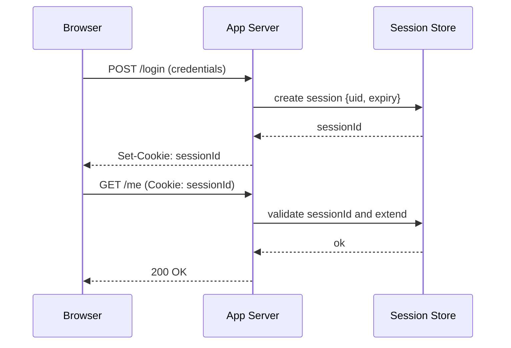
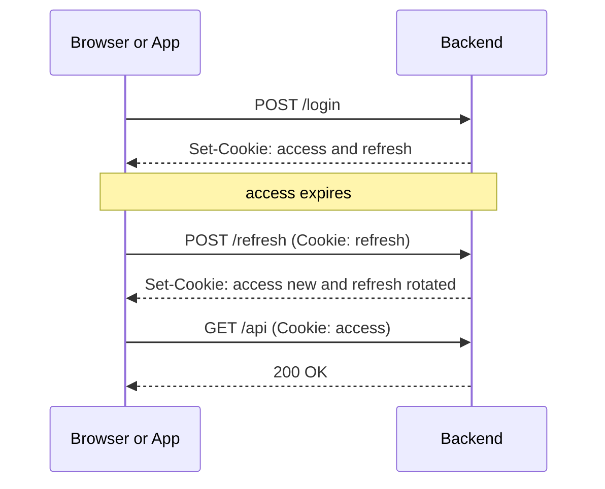
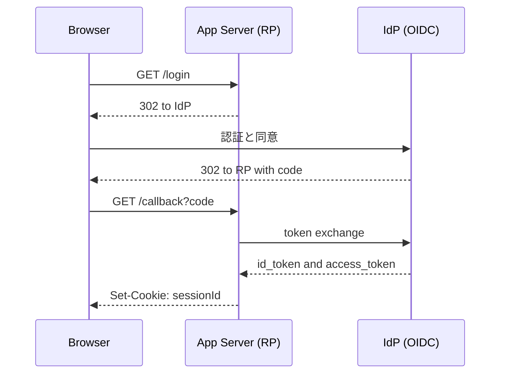
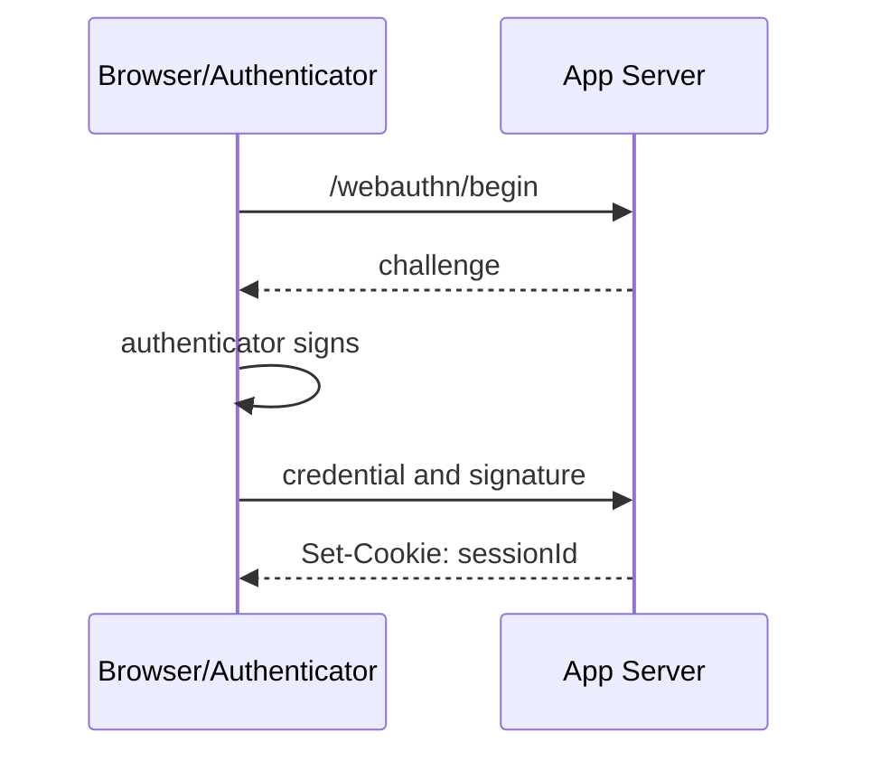

# ログイン管理ドキュメント

対象: 利用者 / 運用者 / 開発者。**正規の手段でログイン状態を安全に維持**するための基礎〜応用を整理。

> 本ドキュメントは「待機列制御（Queue-it）」を除外し、**認証・セッション管理**に特化しています。

---

## 1. 用語の整理

* **セッション**: 認証後に維持されるユーザー状態。ID でサーバ側ストア or トークンで表現。
* **Cookie**: ブラウザが保持する小さなデータ。`Secure` / `HttpOnly` / `SameSite` 等の属性あり。
* **アクセストークン**: API 呼び出し用の短命トークン（JWT など）。
* **リフレッシュトークン**: アクセストークンを再発行する長命トークン。
* **SSO / OIDC**: IdP による認証連携（OAuth2 + OpenID Connect）。
* **WebAuthn/Passkey**: 公開鍵によるフィッシング耐性の高い認証。

---

## 2. アーキテクチャ別の基本フロー（図付き）

### 2.1 サーバセッション + Cookie（最も一般的）

* サーバが `sessionId` を発行。セッション内容はサーバ側ストア（メモリ/Redis/DB）。
* ブラウザは以降のリクエストで Cookie による `sessionId` を送信。



**長所**: サーバ側で失効・強制ログアウトが容易。
**短所**: スケール時に共有ストアが必要。

---

### 2.2 JWT アクセストークン + リフレッシュ（トークンベース）

* `access` は短命、`refresh` は長命。`/refresh` で `access` を更新。
* トークンローテーション（毎回新しい `refresh` を発行）で漏洩耐性を向上。



**長所**: SPA/モバイル/API に適合。
**短所**: 失効/取り消し設計が難しい（ブラックリスト/ローテーション/短命化）。

---

### 2.3 OIDC（Auth Code + PKCE）+ サーバセッション

* RP（自サイト）は IdP へリダイレクト→コード取得→トークン交換→自サイトのセッション発行。



**長所**: SSO 運用に強い。
**短所**: 設定・実装が重い（`redirect_uri` 等）。

---

### 2.4 WebAuthn / Passkey（パスワードレス）

* 端末の認証器でチャレンジに署名し、パスワード無しでログイン。



**長所**: フィッシング耐性・UX 良。
**短所**: 実装/運用の習熟が必要。

---

## 3. 有効期限（Expire）設計の指針

* **セッション Cookie**: `Expires/Max-Age` 無し → ブラウザ終了で削除。
* **永続 Cookie**: `Expires/Max-Age` あり → 指定時刻まで保持。
* **スライディング vs 絶対期限**:

  * スライディング: 利用ごとに延長（30 分など）。
  * 絶対: 最大滞在時間（8 時間/30 日など）。
* **Remember me**: 長期 Cookie を別名で発行し、通常セッションを再確立。
* **トークンベース**: `access(5–30min)` + `refresh(7–90d)` が一般的。

---

## 4. 保存場所と Cookie 属性（安全デフォルト）

| 保存先                            | 推奨度 | 理由                                                    |
| ------------------------------ | --- | ----------------------------------------------------- |
| **HttpOnly Cookie**            | 高   | JS から読めず XSS に強い。`Secure` + `SameSite=Lax/Strict` 推奨。 |
| localStorage/sessionStorage    | 低〜中 | JS から読めるため XSS に弱い。やむを得ず使う時は DPoP 等を追加。               |
| モバイル安全ストレージ(Keychain/Keystore) | 高   | アプリ用の安全領域。                                            |

**Cookie 属性**: `Secure`（HTTPSのみ）, `HttpOnly`（JS不可）, `SameSite=Lax/Strict`（CSRF 軽減）, `Path`/`Domain` の最小化。

---

## 5. セキュリティ（脅威→対策）

* **XSS**: トークン窃取 → エスケープ/CSP/テンプレートの自動エスケープ/HttpOnly。
* **CSRF**: 背乗り送信 → SameSite + CSRF トークン（ダブルサブミット/同期トークン）。
* **セッション固定**: 既知 ID 押し付け → ログイン直後に新しい `sessionId` を発行。
* **ハイジャック**: Cookie 盗難 → 全ページ HTTPS、短命化、IP/UA 監視、全端末ログアウト。
* **リフレッシュ漏洩**: 長命で危険 → ローテーション、バインド、短命化、失効 API。
* **JWT の誤設定**: 署名検証不備/`alg=none` → ライブラリ既定値 + `iss`/`aud`/`exp`/`nbf` 検証。

---

## 6. マルチデバイス/SSO の実務知識

* 端末ごとに独立セッション（推奨）。ユーザー向けに「全端末ログアウト」を提供。
* SSO では **IdP セッション** と **RP セッション** の二層。RP が失効しても IdP は生きていることがある（再発行フローを設計）。
* モバイルアプリは安全ストレージ保管 + 証明書ピンニング + デバイス紐付けを検討。

---

## 7. 調査/運用レシピ（手を動かす）

* **DevTools**: Application → Storage → Cookies で `Name/Value/Expires/HttpOnly/SameSite/Secure` を確認。
* **curl で Cookie 保存/再利用**:

  ```bash
  curl -c cookies.txt -b cookies.txt -L https://example.com
  ```
* **UNIX 時刻の確認**:

  ```bash
  date -u -d @1759410538
  python3 -c 'import datetime;print(datetime.datetime.utcfromtimestamp(1759410538))'
  ```
* **JWT の素性確認（オフライン）**: base64url デコードで `header.payload` を展開し、`iss/aud/exp` を確認。

---

## 8. 実装ベストプラクティス（抜粋）

### 8.1 Cookie セッション（Express 例）

```js
import session from 'express-session';
import RedisStore from 'connect-redis';
app.use(session({
  store: new RedisStore({ /* redis config */ }),
  name: 'sid',
  secret: process.env.SESSION_SECRET,
  resave: false,
  saveUninitialized: false,
  rolling: true,
  cookie: { httpOnly: true, secure: true, sameSite: 'lax', maxAge: 1000*60*30 }
}));
```

### 8.2 アクセス/リフレッシュ（擬似コード）

```
POST /login -> issue access(15m), refresh(30d rotation)
POST /refresh -> verify and rotate -> new access, new refresh
POST /logout -> revoke refresh, clear cookies
```

### 8.3 CSRF 対策（Cookie 認証のとき）

* `SameSite=Lax` 以上 + CSRF トークン（フォーム/ヘッダ）。
* Token は `HttpOnly` Cookie と別の可視トークンとして配布。

---

## 9. チェックリスト（運用/レビュー用）

* [ ] Cookie は `Secure/HttpOnly/SameSite` を付与している。
* [ ] セッションはスライディングと絶対期限の両方を設計。
* [ ] ログイン直後にセッション再発行（固定化対策）。
* [ ] リフレッシュはローテーション + 失効 API を持つ。
* [ ] 「全端末ログアウト」「パスワード変更で全失効」を提供。
* [ ] 監査ログ（ログイン/リフレッシュ/失効）を保存。
* [ ] XSS/CSRF の自動テスト/セキュリティヘッダを有効化（CSP/HSTS）。

---

## 10. まとめ

* ログイン維持は **Cookie セッション** または **トークン + リフレッシュ** が基本軸。
* **属性/期限/保存先**を正しく設計し、XSS/CSRF/固定化/ハイジャックに備える。
* SSO/モバイルを想定した二層セッションやデバイス管理も初期から設計に含める。
