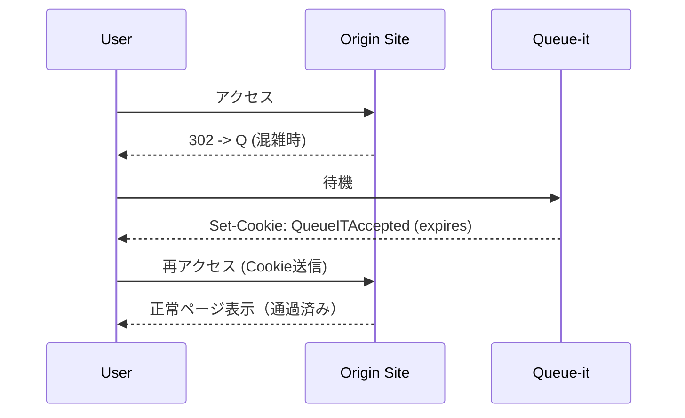

# Queue-it 解説ドキュメント

対象: CTF 学習者 / 開発者 / 運用者。
**Queue-it** は「ログイン認証」ではなく **待機列制御（Virtual Waiting Room）** を目的としたサービス。
ログイン管理とは別の仕組みであることに注意。

---

## 1. Queue-it の目的

* 高負荷イベント（例: チケット販売、限定商品販売）で **アクセス集中を制御**。
* ユーザーに「順番待ち画面」を表示し、通過を制御する。
* 公平性とサーバーの安定稼働を両立する仕組み。

---

## 2. 基本の動作フロー

---

## 3. 主要な Cookie

* **QueueITAccepted**

  * 中身に `EventId`, `QueueId`, `RedirectType`, `IssueTime`, `Hash` を含む。
  * 有効期限 (`Expires`) まで「通過済み」として扱われる。
  * `Hash` により改ざん不可。ユーザーが勝手に延長・書き換えはできない。

* **has_redirected**

  * 状態管理用のセッション Cookie。
  * ブラウザ終了時に削除される。

---

## 4. 認証との違い

| 項目   | ログイン認証        | Queue-it               |
| ---- | ------------- | ---------------------- |
| 目的   | ユーザー本人確認      | アクセス集中の公平制御            |
| 管理対象 | ユーザーアカウント     | 待機列・イベント               |
| トークン | セッションID / JWT | QueueITAccepted (署名付き) |
| 有効期限 | 数分〜数日         | 発行時に決められた短期的な期限        |

Queue-it は **ユーザーが誰かは問わない**。あくまで「順番待ちの通過証明」。

---

## 5. セキュリティ上の仕組み

* **改ざん防止**: `Hash` による署名検証。
* **有効期限**: `Expires` 属性により強制的に切れる。
* **不正共有対策**: IP やブラウザ属性を組み合わせて検証する場合もある。

---

## 6. 利用者視点でのポイント

* Cookie が有効期限内なら **再度待機なしでアクセス可能**。
* Cookie が切れた場合は **再度待機列へ**。
* ブラウザ終了で `has_redirected` が消えても、`QueueITAccepted` が残っていれば通過状態は保持される。
* 「ログイン維持」とは無関係。

---

## 7. 運用者視点でのポイント

* **イベントごとに `EventId` を設定**し、待機列を分離。
* **発行される Cookie の TTL** を調整して、通過後にどれくらいアクセスを許すか制御。
* **監査ログ**でどのユーザーがいつ通過したかを記録。

---

## 8. CTF / 調査での観点

* Queue-it Cookie の中身を読むと **`EventId`, `QueueId`, `IssueTime`, `Hash`** が見える。
* `IssueTime` は Unix epoch（例: 1759410538 → 2025-10-02 19:08:58 UTC）。
* `Hash` の検証がサーバ側で行われるため、ユーザー側での改変は無効。
* 認証系のセッションIDではない → ログイン脆弱性の調査対象にはならない。

---

## 9. まとめ

* **Queue-it はログイン認証ではない** → 混雑制御の仕組み。
* 主要トークンは `QueueITAccepted`。有効期限まで通過を保証、期限切れ後は再待機。
* セキュリティは `Hash` と `Expires` によって担保。
* 学習用途では「Cookie の挙動」「Expire の確認」「改ざん防止の仕組み」を理解するのに有用。
