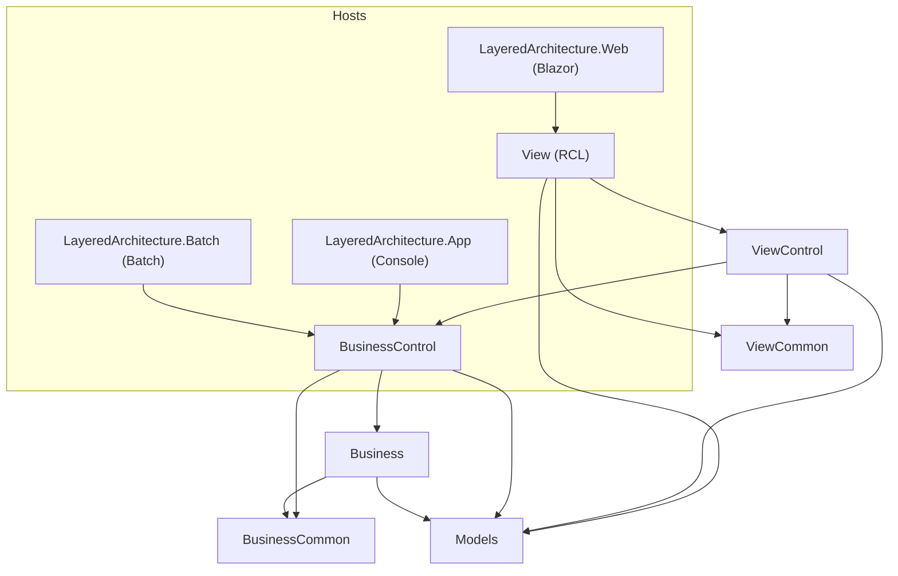
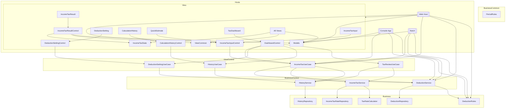

# LayeredArchitecture Sample (View ↔ ViewControl / Business ↔ BusinessControl 多対多)

多層構造で **再利用性・影響範囲の局所化** を狙ったサンプルです。  
UI は Razor Class Library、Blazor Server ホスト、コンソール/バッチを含み、同じ BusinessControl/Business を共有します。

## プロジェクト構成
- `LayeredArchitecture.View` (Razor Class Library) … 画面定義。`IncomeTaxInput`, `IncomeTaxResult`, `DeductionSetting`, `CalculationHistory`, `QuickEstimate`, `TaxDashboard`
- `LayeredArchitecture.ViewControl` … 画面ロジック。`IncomeTaxInputControl`, `IncomeTaxResultControl`, `DeductionSettingControl`, `CalculationHistoryControl`, `DashboardControl`
- `LayeredArchitecture.ViewCommon` … UI 共通ヘルパ。`InputValidationHelpers`, `FormatHelpers`, `UiMessageHelpers`
- `LayeredArchitecture.BusinessControl` … ユースケース統合。`IncomeTaxUseCase`, `DeductionSettingUseCase`, `HistoryUseCase`, `TaxReviewUseCase`
- `LayeredArchitecture.Business` … 業務サービス。`DeductionService`, `IncomeTaxService`, `HistoryService` + Repository 群
- `LayeredArchitecture.BusinessCommon` … 業務共通計算。`DeductionRules`, `TaxRateCalculator`, `PeriodRules`
- `LayeredArchitecture.Models` … DTO 群。`IncomeTaxInputDto`, `IncomeTaxResultDto`, `DeductionSettingDto`, `HistoryDto`, `TaxReviewSummaryDto`
- 実行ホスト: `LayeredArchitecture.Web` (Blazor Server), `LayeredArchitecture.App` (コンソール), `LayeredArchitecture.Batch` (バッチ)

## 参照関係 (mermaid)


## 再利用性と影響範囲を狭める手法
- **View ↔ ViewControl の多対多**: 例えば `IncomeTaxInputControl` を「所得税入力」と「QuickEstimate」の両画面で共有。UI 変更は View 側、入力ロジック変更は ViewControl 側に限定。
- **Business ↔ BusinessControl の多対多**: `IncomeTaxService`, `HistoryService`, `DeductionService` を `IncomeTaxUseCase`, `TaxReviewUseCase`, `HistoryUseCase` で横断利用。ユースケース追加は BusinessControl 側が主、ビジネスルール変更は Business/BusinessCommon 側に限定。
- **共通ヘルパ分離**: 入力バリデーションや表示フォーマットは `ViewCommon`、計算ルールは `BusinessCommon`。変更時の影響範囲を最小化。
- **DTO 集約**: すべての層が共通 DTO (`Models`) を介するため、シリアライズや契約の整合性が取りやすく、差分の影響を見通しやすい。

## 起動と動作確認
- Blazor 画面:  
  ```bash
  cd playground/dotnet/LayeredArchitecture
  dotnet run --project LayeredArchitecture.Web
  ```
  ナビ: `/income-tax`, `/income-tax/result`, `/income-tax/deductions`, `/income-tax/history`, `/income-tax/quick`, `/dashboard`

- コンソールデモ:  
  ```bash
  dotnet run --project LayeredArchitecture.App
  ```

- バッチ (同じ BusinessControl を利用):  
  ```bash
  dotnet run --project LayeredArchitecture.Batch
  ```

## 変更シナリオ例と影響範囲
- UI の入力項目追加: `View` の該当画面 + `ViewControl` の該当コントロール。ビジネスロジック層へは非影響。
- 税率計算ロジック変更: `BusinessCommon/TaxRateCalculator` のみ（ユースケースや画面は無変更で再利用）。
- 新ユースケース追加: `BusinessControl` にユースケースクラス追加し、`ViewControl`/`View` から呼ぶ。既存サービスを組み合わせて再利用。

## ポイント
- **多対多の再利用を許容**しつつ、責務を分離して影響範囲を狭く保つ。
- **共通化の置き場を明確化** (ViewCommon / BusinessCommon / Models) し、層ごとの変更境界をはっきりさせる。
- Blazor/Console/Batch の複数ホストが同じユースケース・サービスを共有することで「ロジック一本化」を実証。


### 依存の矢印（方向性）
- View → ViewControl → BusinessControl → Business → BusinessCommon  
- View → ViewCommon (ヘルパ)  
- すべて → Models (DTO)  

### クラス別参照 (mermaid)

